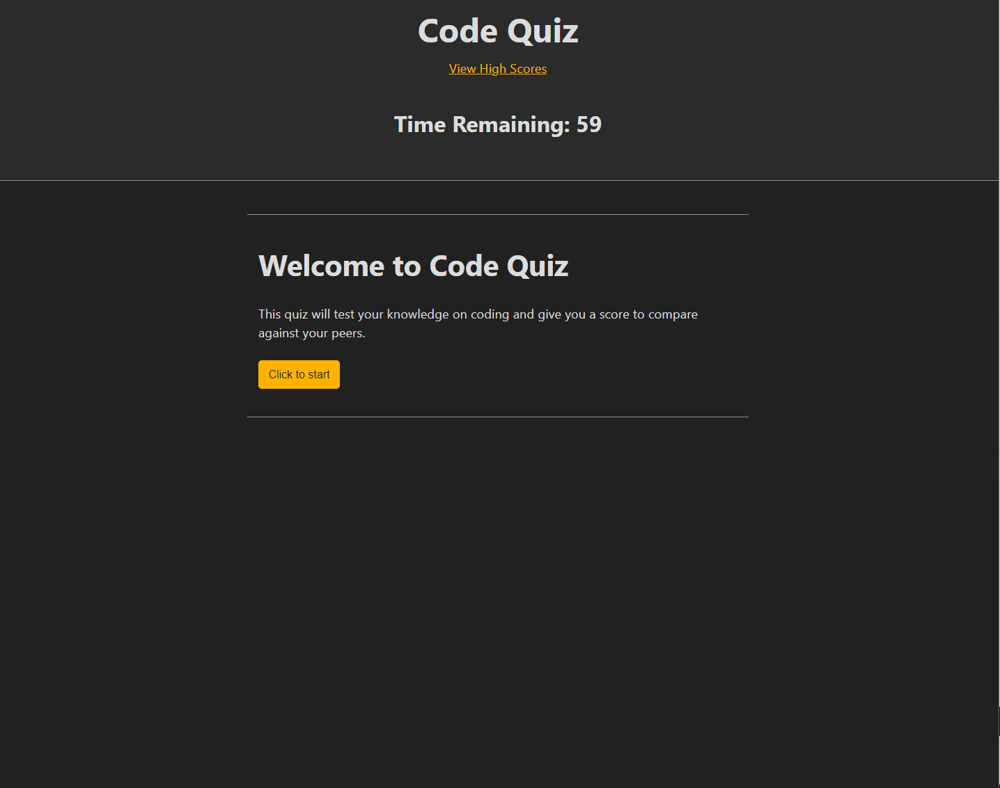

# Code Quiz

[Link to my project](https://smoke5643.github.io/code-quiz/)

## Table of Contents
- [Description](#description-of-project)
- [Visuals](#visuals)

## Description of project

This application was designed to showcase knowledge in Javascript and WebAPI's while mixing with HTML. This code quiz keeps track of a score in the form of time remaining where a correct answer simply proceeds to the need question while an incorrect answer takes time away from the timer. If the timer runs our before all the questions are answered the application ends the quiz. At the end from either answering all questions or running out of time, the user can input their initials to keep track of highscores.

## Visuals

Preview of the code quiz

